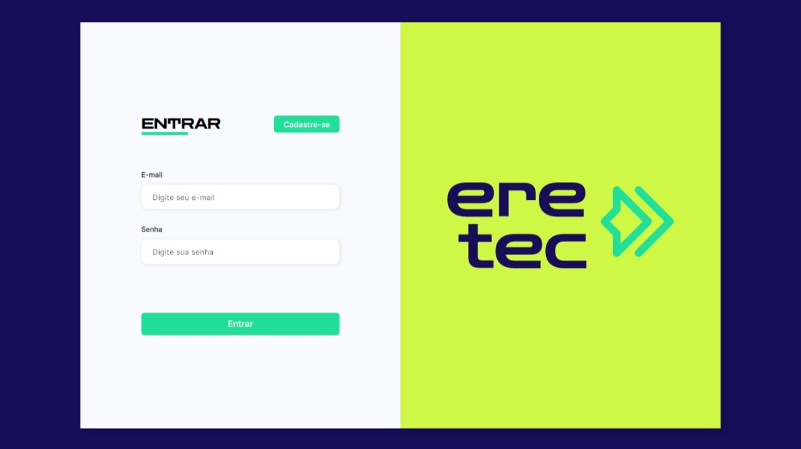
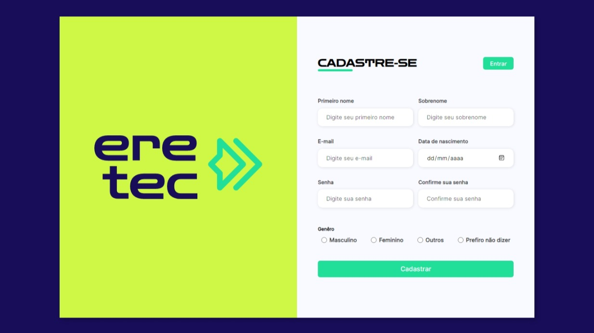

<h1 align="center"> Trabalho de programação web II, 3° e 4° bimestre, 2022 </h1>

    Trabalho feito em grupo para a avaliação do conhecimento dos alunos em certas tecnologias

  <a href="#-tecnologias">Tecnologias</a>&nbsp;&nbsp;&nbsp;|&nbsp;&nbsp;&nbsp;
  <a href="#-projeto">Projeto</a>&nbsp;&nbsp;&nbsp;|&nbsp;&nbsp;&nbsp;
  <a href="#-layout">Layout</a>&nbsp;&nbsp;&nbsp;

 

## 🚀 Tecnologias

Esse projeto foi desenvolvido com as seguintes tecnologias:

- HTML e CSS;
- JavaScript;
- PHP, PHPMailer;
- MySQL

## 💻 Projeto

A ERETEC é o encontro regional de recnologia da região de Pereiro, e visando isso alguns alunos do curso de informática fizeram um site que pode visar o credenciamento desse evento futuramente
Consiste em uma página de cadastro do participante do evento e também uma de login, o usuário pode fazer o login e ver as informações que colocou em seu cadastro em um painel. 
SISTEMA AINDA EM APERFEIÇOAMENTO!

## 🔖 Layout

  

  

Feito com ♥  